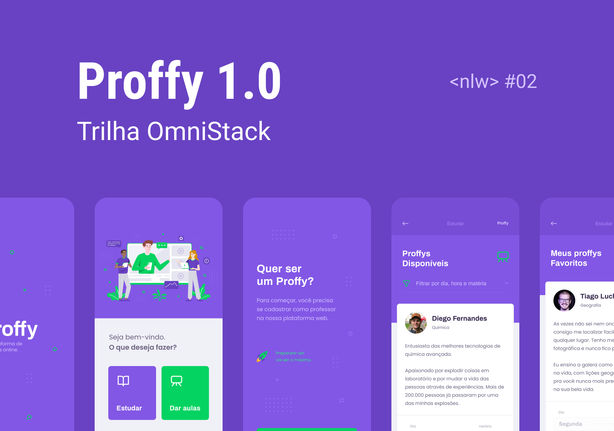

<h3 align="center">
    
    <br>
</h3>

<p align="center"> Aplicação desenvolvida durante a Next Level Week 2.0 da Rocketseat. </p>

## O que é o Proffy?

O Proffy é uma aplicação que visa conectar professores e alunos interessados em aulas particulares de assuntos diversos.

## Tecnologias Utilizadas

O projeto foi desenvolvido utilizando as seguintes tecnologias

- TypeScript
- Node.js
- ReactJS
- React Native

## Manual de utilização

### 1. Clonar o projeto em seu computador.

### 2. Instalação - Back-End
Para instalar as dependências e executar o back:

```bash
cd server
yarn install
yarn start
```

### 3. Instalação - Front-End 
Para instalar as dependências e iniciar o front:

```bash
cd web
yarn install
yarn start
```

### 4. Instalação - Mobile
Primeiramente é necessário colocar o IP do computador no arquivo "src/services/api.ts". Em seguida:

```bash
cd mobile
yarn install
expo start
```

<h4 align="center">
    Projeto por <a href="https://www.linkedin.com/in/gabriele-jandres-cavalcanti-249107175/" target="_blank"> Gabriele Jandres </a>
</h4>
